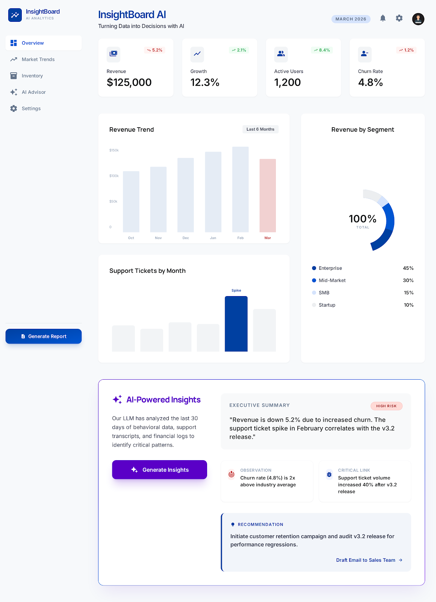
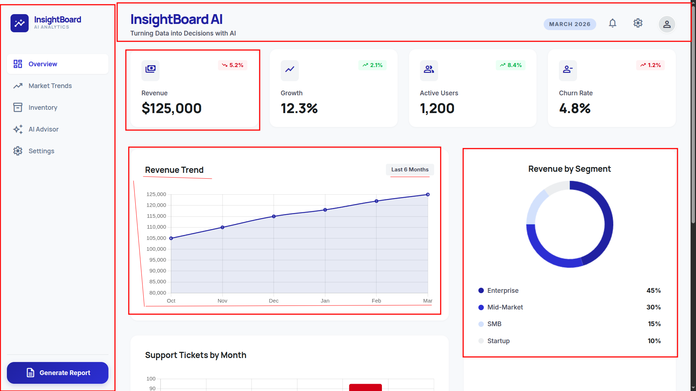
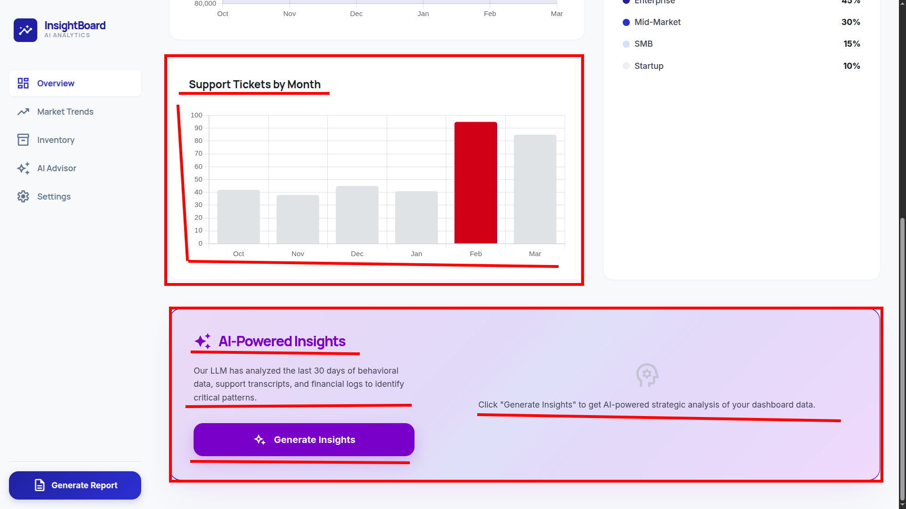

# InsightBoard AI

> Turning Data into Decisions with AI

A modular Liferay Fragment collection that transforms any portal page into an intelligent business command center. InsightBoard AI doesn't just display metrics — it interprets them, delivering real-time executive summaries, anomaly detection, and strategic recommendations powered by Mistral AI.



---

## Features

- **4 KPI Cards** — Revenue, Growth, Active Users, Churn Rate with trend indicators
- **Revenue Trend Chart** — 6-month line chart with Chart.js
- **Revenue by Segment** — Doughnut chart with segment breakdown
- **Support Tickets** — Monthly bar chart with anomaly highlighting
- **AI-Powered Insights Panel** — Executive summary, risk level, observations, and strategic recommendation generated by Mistral AI
- **Zero-Config Ready** — Works out of the box with built-in mock data
- **Configurable via Liferay UI** — AI endpoint, persona, and business metrics all configurable per fragment instance
- **localStorage Caching** — Instant reload without re-calling the AI API

---

## Architecture

```
Liferay Page
  └── InsightBoard AI Fragments (HTML/CSS/JS)
        └── AI Insights Fragment
              └── POST http://localhost:3000/api/analyze
                    └── Node.js Middleware (Express)
                          └── Mistral AI API
```

The frontend fragments are pure HTML/CSS/JS — no build step required. The AI Insights fragment calls a lightweight Node.js middleware that securely forwards requests to the Mistral AI API and returns a structured JSON response.

---

## Fragments

| Fragment | Description |
|---|---|
| **InsightBoard Header** | Branded dashboard header with title, date, and action icons |
| **InsightBoard Sidebar** | Navigation panel with menu items |
| **InsightBoard KPI Card** | Single KPI display with value, label, trend indicator, and icon |
| **InsightBoard Revenue Trend** | 6-month revenue line chart |
| **InsightBoard Revenue Segment** | Revenue breakdown doughnut chart with legend |
| **InsightBoard Support Tickets** | Monthly support ticket bar chart with spike detection |
| **InsightBoard AI Insights** | AI analysis panel with executive summary, observations, and recommendations |

---

## Requirements

- Liferay DXP / Portal **7.4+**
- Node.js **v18+** (for the AI middleware)
- A [Mistral AI](https://mistral.ai) API key

---

## Installation

### 1. Install the Fragment Collection

**Via Liferay Marketplace:**
Install directly from the Marketplace and the fragment collection will be available in your site's Fragment editor under **InsightBoard AI**.

**Via ZIP import:**
1. Download `insight-board-ai-fragments.zip`
2. Go to **Site Administration → Design → Fragments**
3. Click **⋮ → Import** and upload the ZIP
4. All 7 fragments will appear under the **InsightBoard AI** collection

### 2. Set Up the AI Middleware

```bash
git clone https://github.com/patrickpassosb/insight-board-ai.git
cd insight-board-ai/api
npm install
cp .env.example .env
```

Edit `.env` and add your Mistral API key:
```
MISTRAL_API_KEY=your_key_here
```

Start the server:
```bash
npm start
# Runs on http://localhost:3000
```

### 3. Add Fragments to a Page

1. Go to **Site Administration → Site Builder → Pages**
2. Create or edit a **Content Page**
3. In the Fragments panel, find **InsightBoard AI**
4. Drag fragments onto the page in any layout you prefer
5. Click **Publish**

---

## Configuration

The **AI Insights** fragment is fully configurable per instance via the Liferay fragment configuration panel:

### API Configuration

| Field | Description | Default |
|---|---|---|
| **AI Proxy URL** | Endpoint of the Node.js middleware | `http://localhost:3000/api/analyze` |
| **AI Persona / Context** | The AI's role and business context | COO strategic analysis persona |

### Business Metrics

| Field | Description | Default |
|---|---|---|
| **Analysis Period** | Label for the analysis timeframe | `Current Month` |
| **Revenue ($)** | Total revenue figure | `125000` |
| **Revenue Growth (%)** | Revenue growth rate | `-5.2` |
| **Active Users** | Number of active users | `1200` |
| **Churn Rate (%)** | Customer churn rate | `4.8` |
| **Support Tickets** | Number of support tickets | `85` |

All default values are pre-filled with realistic mock data, so the fragment works immediately without any configuration.

---

## Tech Stack

| Layer | Technology |
|---|---|
| Frontend | HTML5, CSS3 (Clay-compatible), Vanilla JS |
| Charts | [Chart.js](https://www.chartjs.org/) 4.x (via CDN) |
| Icons | [Material Symbols](https://fonts.google.com/icons) (via CDN) |
| Backend | Node.js + Express |
| AI Engine | [Mistral AI](https://mistral.ai) API (mistral-large-latest) |
| Caching | localStorage |

---

## Screenshots

| Dashboard Overview | KPI Cards & Charts |
|---|---|
|  |  |

| AI Insights Panel |
|---|
|  |

---

## License

MIT © Patrick Passos
